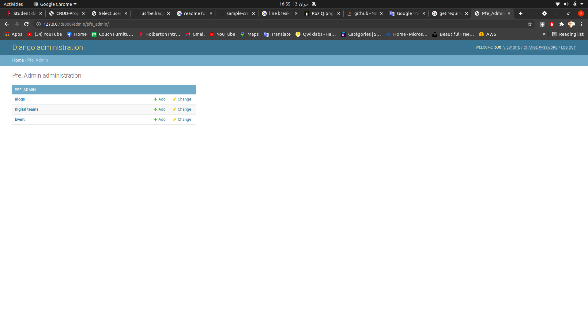
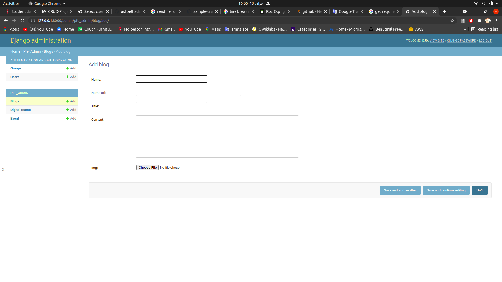
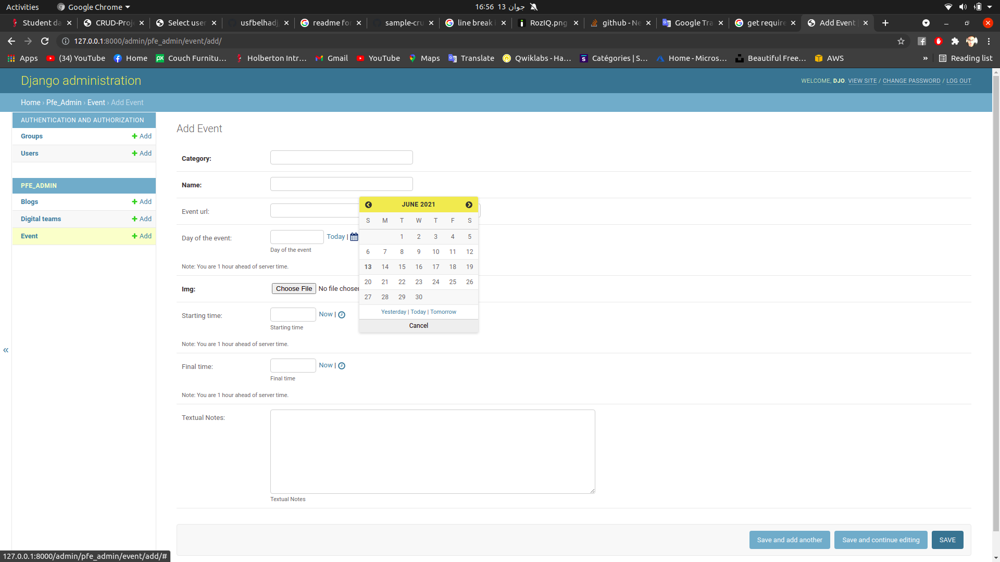
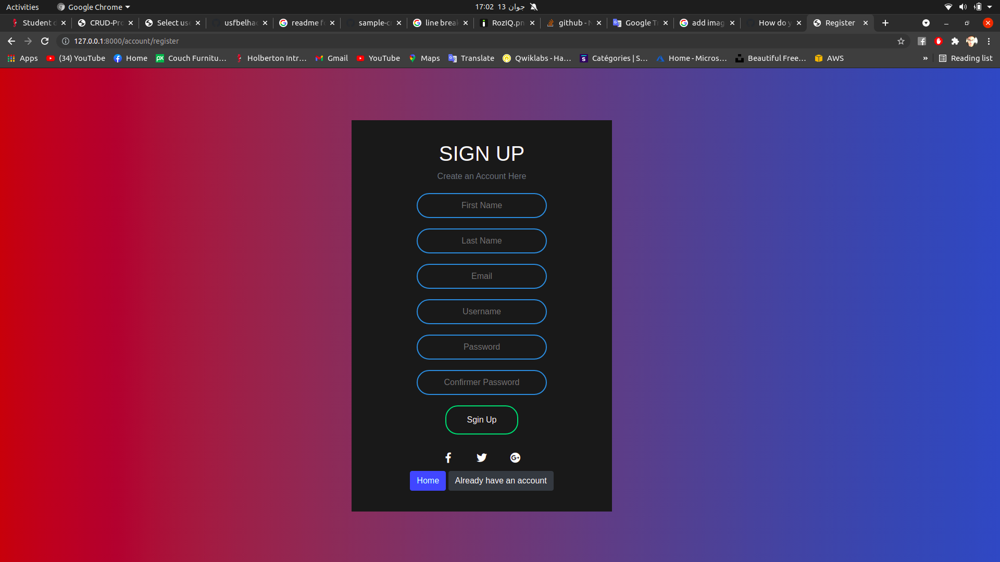
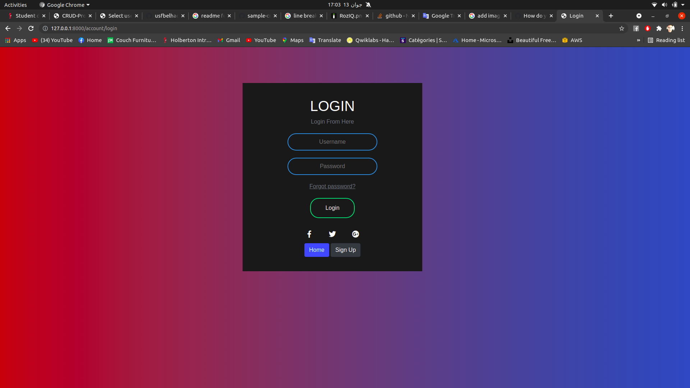

# CRUD Project
## For The Admin:
This project made to post blogs that content URLS to navigate and image for the blog and same thing if you want to post an events and DigetalTeam. the admins of this website are the controleur about everything


## For The User:
a project that could sign up and login for the user to see what the admin has updated or upload for blogs or event with a notification for any updates happen

# Admin Side

# Blog Side

# Event Side

# Web Site - Sing-Up

# Web Site - Login


## Technologies:
* Djnago
* Python
* Jinja
* HTML 5
* CSS 3
* Bootstrap
* Javascript

# Setup
## Recommended requirements setup for applications
### 1 - Install Requirements
```
pip install -r requirements.txt
```
### 2 - Command that runs a file
```
source venv/bin/activate
```
### 3 - Move to the basic directory
```
cd pfe
```
### 4 - Run the project
```
python manage.py runserver
```
# Author
[youssef belhadj](https://www.linkedin.com/in/youssef-belhadj-5393631a0/)